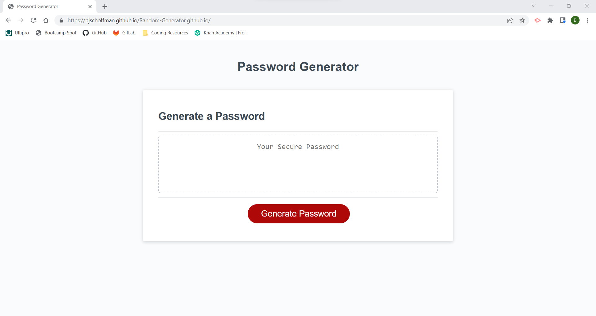
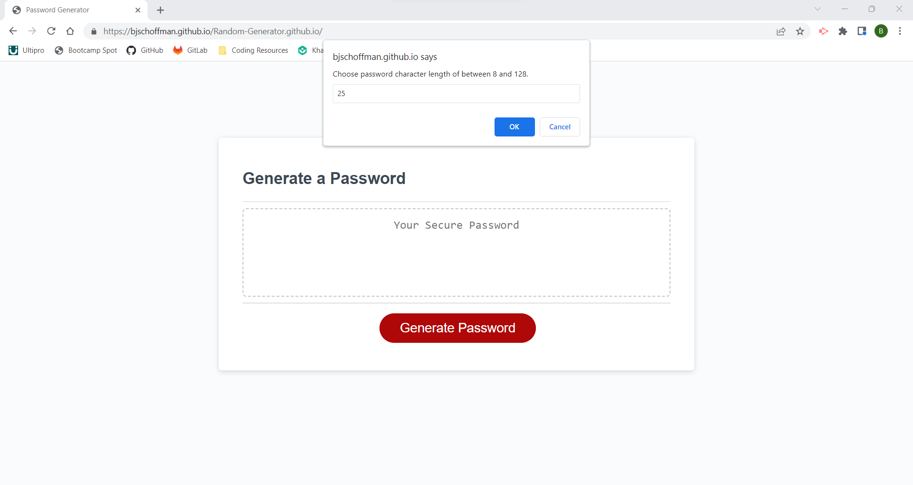
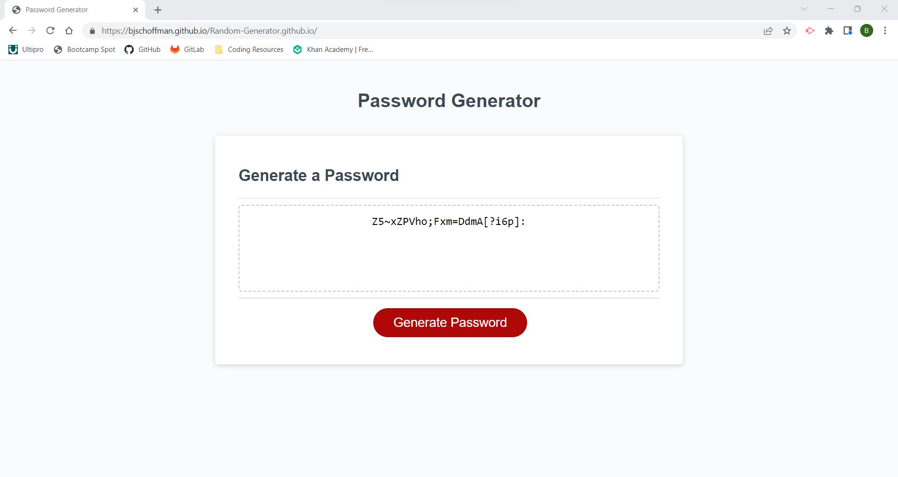

# Random-Generator
Challenge 3 - JavaScript Password Generator

## Description

To create a web browser based password generator. So that emlpoyees can create their own custom password based on the criteria they choose.

## Usage

To launch, go to: [https://bjschoffman.github.io/Random-Generator.github.io/](https://bjschoffman.github.io/Random-Generator.github.io/) 

    
    
    

## Credits

I referenced the [github repository](https://github.com/njthanhtrang/3.-JavaScript-Challenge-Password-Generator) of Jennifer Nguyen.

## License

MIT License Copyright (c) 2022 bjschoffman

